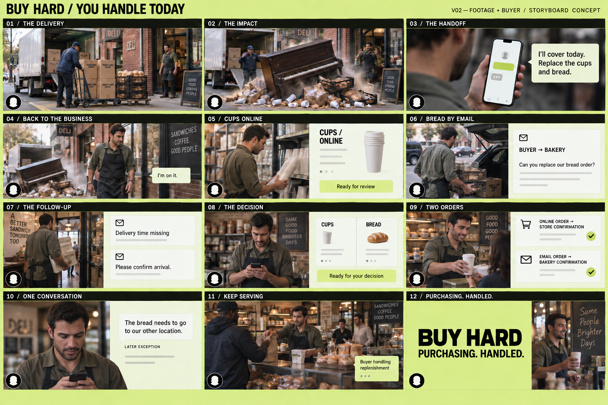

# You handle today — footage version

Version 03 · September 13, 2026 · 3:00 · storyboard and footage review assembly.

The delivery and the owner’s immediate response carry the film. The buyer’s work appears beside the footage while the owner buys emergency supplies and gets back to serving customers. Facundo’s real narration remains a separate, small camera overlay. The person pictured is a fictional stand-in for the owner, not a portrait of Facundo.

The contact sheet is a photographic concept storyboard. The [production review](./assembly/README.md) now assembles the generated footage with illustrative buyer cards; verified app captures and Facundo’s recording are still pending. This is a second treatment alongside the [graphic version](../you-handle-today/README.md). The [version-specific recording sheet](./narration.md) preserves the current script with a revised closing beat to match the footage.

[Generation research and cost estimate](../../../docs/demo-video-generation-research-2026-09-12.md) · [Budget calculations](./generation-budget.csv)

[First three-shot test: frame briefs, motion prompts and cost](./pilot.md)

**September 13, production review:** [Three-minute assembly and all selected footage](./assembly/index.html). The approved [piano crash](./pilot/README.md) carries through into the owner’s emergency shopping and return. On his return, a cleanup crew works at the original doorway; the truck and startled driver are gone. Turbo remains selected. Seventeen generated video requests so far, estimated charges $1.80 ($0.90 for this continuation and cleanup correction).

## Shot sequence

| Panel | Time | Picture and action | Buyer layer / narration cue |
| --- | --- | --- | --- |
| 01 | 0:00–0:17 | Wide sidewalk view. A worker unloads cups and bread from a delivery truck outside the deli. Cut to cartons on the hand truck, bread crates, the owner at the doorway. | Full footage. “The best day … you barely think about purchasing.” Establish one shipment with both products. |
| 02 | 0:17–0:33 | Same sidewalk and truck. A shadow crosses the shipment; hard cut on impact to the piano crushing the boxes and crates. Cups and bread scatter. Hold the owner’s dry reaction. | Full footage. “A piano lands on our shipment.” One impact sound, then a beat of quiet. A composite or generated insert supplies the impact; stage no real drop around people. |
| 03 | 0:33–0:58 | Owner takes out his phone. Over-shoulder view of the app, then his reaction as he sends the handoff. | Enlarge the actual message beside the phone so viewers can read it. He says he will cover the emergency and assigns replacement cups and bread. Use actual supported input; do not imply an unverified voice-call feature. |
| 04 | 0:58–1:04 | He pockets the phone, takes his keys and leaves to get emergency supplies. | One brief buyer acknowledgement. Then let the message recede. “The buyer takes it from there.” |
| 05 | 1:04–1:15 | Owner choosing emergency cups at a local shop. | Side-by-side: online replacement cup product, terms and purchase ready for review. “It checks the right product…” The local pickup and online order are different purchases. |
| 06 | 1:15–1:30 | Owner loads the emergency shopping into a parked car. | Side-by-side: buyer’s bakery enquiry, then reply with price but no delivery time. No owner interaction with these emails. |
| 07 | 1:30–1:49 | He brings emergency supplies into the original doorway at right. Two workers clean around the piano; the delivery truck and driver have left. | The buyer’s follow-up, bakery’s completed terms. The return is full-width at 1:32–1:37, between the follow-up and reply. Preserve the reply chronology. |
| 08 | 1:49–2:07 | Owner is stationary in the deli. One short phone check for the decision. | Cup and bread terms, separate costs and arrival expectations. Actual supported approvals. This is the only planned interruption after the handoff. |
| 09 | 2:07–2:27 | Owner serves a customer using the emergency supplies he picked up. | Online cup order → store confirmation; emailed bread order → bakery confirmation. Show each supported result separately. The footage does not show the new replacement orders arriving. |
| 10 | 2:27–2:40 | A possible later exception: owner sends another short message in the phone app. | “The bread needs to go to our other location.” Retain **Later exception**. This illustrates a request, not a supplier’s acceptance of the address change. |
| 11 | 2:40–2:52 | Back to wide deli footage: customers served, owner engaged with the business, phone put away. | A small buyer status only if supported. Narration changes to “I handled those emergency supplies…” because the pickup is already shown. |
| 12 | 2:52–3:00 | Lime end card; optional narrow strip of service footage at the edge. | BUY HARD / PURCHASING. HANDLED. Keep Facundo’s camera visible through the close. |

The picture plan totals 180 seconds. Panels 04–05 share narration block 04; panels 06–07 share block 05. The rest map directly to the numbered recording blocks.

## How footage and app share the screen

Use three clear compositions:

- **Full footage:** delivery, impact, owner leaving, and final service. The real-world action establishes why the buyer matters.
- **Phone plus enlarged message:** handoff and approval. Keep the genuine phone screen visible in context, then show its relevant content larger beside it. No tiny phone text for viewers to decipher.
- **Side-by-side:** owner doing physical work on the left, readable product or email evidence on the right. This dominates the middle. Let the buyer evidence briefly expand when more reading space is needed.

Avoid a dense translucent interface floating over a moving face. Small updates can overlay quiet areas of the shot; longer emails get an opaque pale panel. Keep the owner moving through a continuous emergency-pickup sequence, not repeatedly reaching for the phone.

At 1920×1080, reserve the bottom 196 pixels as a lime presenter/caption area. Use a 148-pixel circular narrator at x=28, y=908, and subtitles from x=230 to x=1760. All main imagery stays above y=884. For side-by-side shots, use x=24–1048 for footage and x=1072–1896 for the buyer. A thin dark rule separates them. For an email reading hold, expand the buyer area and crop the footage closer without moving the presenter. The contact sheet approximates this arrangement; these measurements guide the final composition.

Keep the current lime `#dce985`, near-black `#15170f`, pale `#eef1d5`, plain type and thin rules in the editorial layer. Footage retains natural light and skin tones. The circle in the drawings is a placement placeholder, not an additional character.

## Footage and sound

Maintain the same owner, wardrobe, storefront, cup cartons and bread crates across the exterior shots. Keep the truck and driver through the initial crash and handoff; by the owner’s return they have left and a cleanup crew is working. Keep the piano and original doorway in the same positions. Use an establishing shot before the piano insert so its location makes sense. An unexpected thud and brief silence sell the joke; it does not need a long falling-piano sequence.

Capture the owner’s phone actions while stationary. The emergency shopping sequence can be three short clips: selecting supplies, loading the parked car, bringing them into the deli. Capture service with those supplies for the end. Final replacements remain incoming unless separate receipt evidence establishes their arrival.

Narration stays conversational. Use quiet truck, street, keys and shop sounds underneath. Avoid repeated notification pings; the point is that the owner can get on with the business.

## Build notes

Prepare the unloading/impact/phone sequence first, then one complete side-by-side email beat. Once their tone and readability work, assemble the remaining frames and record the narrator. Fit holds to the spoken delivery; do not speed up the voice to force the cut.

Replace conceptual UI with genuine supported app captures. Match the cup store, bakery messages, approval and confirmation evidence to the same purchasing scenario. Keep any unverified depiction clearly labeled as a concept; a generated screen is not product proof. No technology-provider names or extra slogans in the narration or editorial cards. The [main screenplay](../../../docs/demo-screenplay.md) retains the evidence requirements for both buying routes.

Delivered here: the storyboard, selected generated footage, production notes and a three-minute review composition. Verified app capture, phone-screen compositing, Facundo’s recording and the final narration-led edit remain production steps. The [assembly notes](./assembly/README.md) distinguish the illustrative cards from app evidence and document the selected takes and costs.
