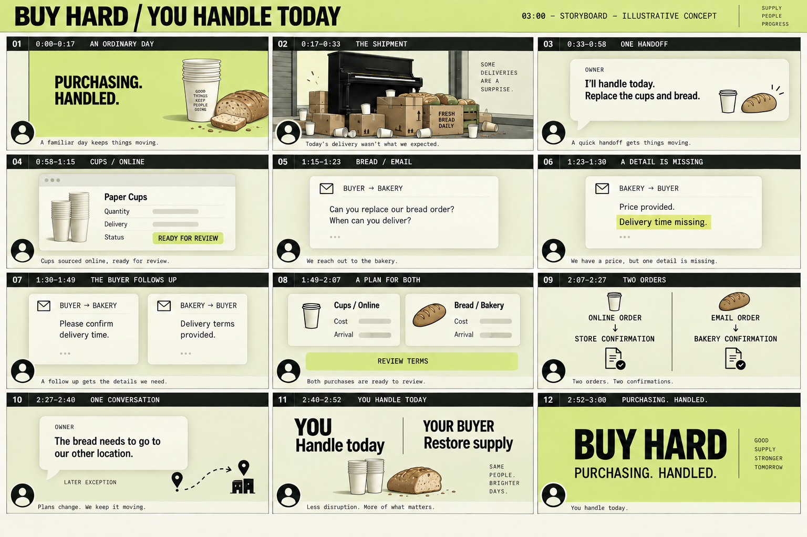

# You handle today — visual storyboard

September 12, 2026 · 3:00 · 12 visual panels · 10 narration blocks.

This is the current storyboard for the damaged shipment story. It replaces the older Last Lid direction for this film. The drawings and interface cards are illustrative concepts, not captured product behavior. The presenter circles reserve space for Facundo’s real Loom-style camera overlay; they are not a proposed likeness.

Use the [recording script](../../../docs/demo-voiceover.md) for the exact spoken words and the [screenplay](../../../docs/demo-screenplay.md) for evidence and capture requirements. The board’s tiny decorative slogans and captions are visual exploration, not additional narration or required final-screen copy.

## Frame-by-frame edit

| Panel | Time | Voice cue | Picture / motion |
| --- | --- | --- | --- |
| 01 | 0:00–0:17 | “The best day … you barely think about purchasing.” | Still lime opening, cups and bread establish the everyday supplies. Small wordmark reveal; keep the camera bubble fixed. |
| 02 | 0:17–0:33 | “A piano lands on our shipment.” | Cut to the ruined shipment, both cups and bread clearly affected. One short impact beat, then a still hold. No people in the impact area. |
| 03 | 0:33–0:58 | “I know where to get enough to keep us going.” | Owner’s handoff appears in a readable message. The board abbreviates it; the recording sheet contains the full request. Do not animate a long typing sequence. |
| 04 | 0:58–1:15 | “For the cups, it checks the right product…” | Three brief states: product match, quantity/delivery, purchase ready for review. Online ordering stays visibly unsubmitted until approval. |
| 05 | 1:15–1:23 | “Our bakery works by email…” | Outgoing request to the bakery. Hold on bread requirements and delivery question. |
| 06 | 1:23–1:30 | “They reply with a price…” | Incoming reply; highlight only the missing delivery time. No interruption to the owner. |
| 07 | 1:30–1:49 | “The buyer follows up…” | Follow-up out, completed terms back. Hold each message long enough to read. The cards stand for the actual exchange to be captured. |
| 08 | 1:49–2:07 | “What comes back to me is a plan for both…” | Show cups and bread, each with its own cost and arrival. The board has placeholders, not prices. Use supported approval controls in the final capture; the paired cards are editorial summaries. |
| 09 | 2:07–2:27 | “Once I approve…” | After approval: online cup order, emailed bread order, store confirmation, bakery confirmation. Reveal the paths separately so both outcomes are clear. No physical receipt implied. |
| 10 | 2:27–2:40 | “The bread needs to go to our other location.” | One possible later exception, clearly separated from the main purchase. The arrow illustrates the request, not acceptance by the bakery. |
| 11 | 2:40–2:52 | “There are customers waiting.” | Quiet owner/buyer responsibility split. Return visual attention to Facundo. |
| 12 | 2:52–3:00 | “Your buyer handles the buying.” | BUY HARD / PURCHASING. HANDLED. Hold the final frame, camera visible. |

## Production layout

Final frames are 1920×1080, 30 fps. The contact sheet is a visual overview; its panel proportions are not the final composition measurements. Use the [visual treatment](../../../docs/demo-film-treatment.md) for exact presenter, product and subtitle safe areas. Retain lime `#dce985`, near-black `#15170f`, pale `#eef1d5`, thin rules and plain typography.

Replace illustrative screen cards with genuine captures when the flow is verified. Do not fabricate messages or order confirmations as working UI. If showing an unverified concept, retain a clear concept label. Keep technology-provider names out of the narrated story and added graphics. No supplier contact, checkout, video composition or render was performed to create this storyboard.
