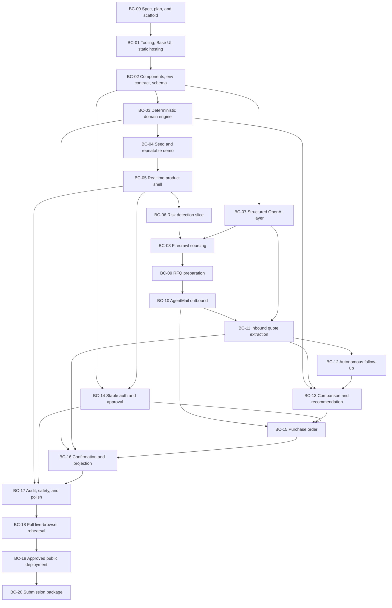

# Autonomous Buyer implementation plan

Status: BC-00 through BC-17 implemented. Live email proof awaits approved controlled recipients; public judge safety is browser-proven.

This document turns the [product spec](./product-spec.md) into ordered build
contexts. Each context is intentionally small enough to hand to an agent or a
developer without loading the entire product into working memory.

## 1. Delivery target

Build one honest, repeatable purchasing loop for Acme Foods and SKU
`LID-16-TE`:

1. Detect a near-term stockout with deterministic inventory math.
2. Open one persisted procurement.
3. Discover and verify real supplier options with Firecrawl.
4. Send real RFQs and receive real replies through AgentMail.
5. Use an OpenAI model to extract and explain structured information.
6. Compare quotes deterministically.
7. Require an authenticated buyer to approve, modify, or reject.
8. Send one purchase order and process its confirmation.
9. Update the inventory projection live in Convex.

The public dashboard must run on `convex.site`, be viewable without an invite,
and make the whole flow inspectable without exposing prompts or private
reasoning.

## 2. Fixed implementation rules

- Convex is the backend and system of record.
- TanStack Start runs as a static SPA. Dynamic work belongs in Convex
  functions, not TanStack server functions or runtime routes.
- Convex HTTP actions live under `/api/*`; static hosting owns `/`.
- Use shadcn components backed by Base UI. The full catalog is installed now
  and can be pruned after the product is stable.
- Use OXC: Oxlint for linting and Oxfmt for formatting. Keep `tsc --noEmit` as
  a static type gate.
- Do not add unit tests, integration suites, snapshot tests, mocks, or broad
  automated test infrastructure.
- Product proof happens only through real user flows in a live browser. OXC,
  type checking, and a production build are static gates, not substitutes for
  browser proof.
- Do not use an LLM for inventory math, money math, state transitions, hard
  constraints, ranking, or PO totals.
- Every external claim must point to a website, supplier message, historical
  record, or clearly marked inference.
- All purchase orders require human approval for the demo.
- The dashboard is the only dense screen. Every other screen presents one
  current step, one explanation, and at most one primary action.
- Agent guidance may navigate, highlight, explain, and prepare drafts. It may
  not approve, reject, accept changed terms, or bypass an external-send gate.
- Maximum automatic follow-ups: two per supplier.
- External sends and provider callbacks must be idempotent.
- Never store secrets in source, events, logs, or browser-visible values.
- Never deploy production or send external email without the explicit approval
  named in the relevant build context.

## 3. Architecture decisions

### Workflow core with a guided agent surface

Use `@convex-dev/workflow` for durable orchestration. The product is a persisted
business state machine with a few AI-assisted steps. The visible agent is a
real-time collaborator over that workflow: it explains the current state,
offers a next step, navigates after consent, and highlights stored evidence.
It does not become a second source of truth or a hidden path around mutations.

Use contextual guidance derived from procurement state and durable events. Add
`@convex-dev/agent` for conversation, with threads attached to stable component
or highlight anchors inside a procurement. There is no dedicated AI chat page.
Conversation history stays separate from business events, and agent tools call
the same authorized workflow functions as the UI. RAG and vectors are not
needed for the demo.

Store a small app-owned thread link for each anchor: organization, procurement,
buyer, stable `anchorKey`, component thread ID, unread state, and timestamps.
The component owns the visual entry point; `@convex-dev/agent` owns messages.
Anchors identify product concepts such as `recommendation`,
`recommendation.arrival`, or `alternative:{supplierId}`, never CSS selectors.

Each workflow step must be safe to resume. Before an external action, write a
stable intent/idempotency key. After it returns, store the provider receipt.
Workflow retries may repeat reads and calculations but must not duplicate an
RFQ, follow-up, or PO send.

### AI transport

Use TanStack AI as the typed model layer, but run it only inside server-side
Convex Node actions. The static TanStack Start app must never call a model
provider or hold an API key.

Recommended first path:

- Install `@tanstack/ai` and `@tanstack/ai-openai` in BC-07.
- Call the OpenAI Responses API with `openaiText("gpt-5.4-mini")`, after a
  one-call account availability check.
- Store `OPENAI_API_KEY` only in Convex deployment environment variables.
- Use non-streaming `chat({ outputSchema })` for business tasks. Persist the
  validated object, then let Convex realtime queries update the browser.
- Record transport, exact model ID, task, evidence IDs, completion status, and
  confidence on every `aiRun`.

Optional path:

- Keep `@tanstack/ai-openrouter` behind the same `getLanguageModel()` adapter as
  a fallback using `openai/gpt-5.4-mini` and the user's OpenRouter key.
- Convex AI Gateway can be a later transport option if plan access is
  available. Do not block the build on it.

Direct OpenAI is the demo path because it makes the sponsor work unambiguous.
TanStack AI supplies types, schema validation, and provider portability; it
does not replace OpenAI. If token streaming becomes useful, persist chunk
batches in Convex and subscribe to them instead of adding a TanStack Start
server route.

### Money, quantity, and time

- Quantity: whole units.
- Unit prices: integer microdollars so sub-cent prices remain exact.
- Extended price, freight, and totals: integer cents.
- Business dates: `YYYY-MM-DD` in the demo organization's timezone.
- Event ordering and audit timestamps: UTC milliseconds.
- Confidence: number from `0` through `1`.
- Avoid floating-point financial comparison.

### Known spec math ambiguity

The spec says a 15,000-unit order provides 24.5 days of coverage:
`15,000 / 612 = 24.5`. That is **order-only coverage**. If 1,404 units remain
when it arrives, projected total coverage is `(15,000 + 1,404) / 612 = 26.8`
days. The UI must label both values explicitly and never present one as the
other.

## 4. Dependency graph



Critical path: `BC-00 → 01 → 02 → 03 → 04 → 05 → 06 → 08 → 09 → 10 → 11
→ 12 → 13 → 15 → 16 → 17 → 18 → 19 → 20`.

After `BC-02`, the AI layer (`BC-07`) and auth/approval identity (`BC-14`) can
run in parallel with the deterministic dashboard branch. Do not parallelize two
contexts that both change the schema or state-transition contract.

## 5. Build-context handoff contract

Every context should begin by reading only:

1. `AGENTS.md`.
2. This document's fixed rules and the assigned context.
3. The relevant sections of `docs/product-spec.md`.
4. The directly relevant Convex component guidance.

Every context must state:

- its accepted input contracts;
- the files and tables it owns;
- migrations or environment names it adds;
- the live browser flow it will prove;
- any real external side effect that requires approval.

Every context ends with OXC, formatting, type checking, and build checks where
applicable, followed by its named live-browser flow. It adds no test runner or
test files. Update `hackathon.md` only after the claimed evidence exists.

## 6. Ordered build contexts

### BC-00 — Spec, plan, and scaffold

Depends on: nothing. Status: complete.

Load: product summary, demo goal, non-goals, and hackathon requirements.

Work:

- Preserve the supplied spec verbatim in `docs/product-spec.md`.
- Keep one repository root with `hackathon.md` at the root.
- Create the TanStack Start + Convex development scaffold.
- Write this implementation plan.
- Keep `.env.local` ignored and add names-only `.env.example`.

Exit proof: the scaffold opens in a live browser. Nothing is publicly deployed.

### BC-01 — OXC, Base UI, and static-host discipline

Depends on: BC-00. Status: complete.

Load: only app shell, package/config files, static-hosting guidance, and Base UI
provider guidance.

Work:

- Replace ESLint/Prettier with Oxlint/Oxfmt.
- Move Tailwind to v4 and use the Vite plugin.
- Initialize shadcn `base-nova`; import the full component catalog.
- Mount `TooltipProvider` and keep the document root isolated for Base UI
  portals.
- Register `@convex-dev/static-hosting` at `/`; reserve `/api` for Convex HTTP
  actions.
- Configure the TanStack SPA shell as `dist/client/index.html` and upload only
  `dist/client` to static hosting.
- Keep TanStack server functions and runtime routes out of this static app.
- Remove the generated fake Chef controls.

Exit proof: OXC, format check, typecheck, and static build pass; the browser
shows the honest scaffold shell.

### BC-02 — Component registrations, environment contract, schema, and indexes

Depends on: BC-01. Status: complete.

Load: spec sections 23–27, the state list, and each selected component's setup
guide.

Work:

- Register `@convex-dev/workflow`, `@firecrawl/firecrawl-convex`, and
  `@agentmail/convex` in `convex/convex.config.ts`.
- Add provider names to `.env.example`; set real values only with
  `npx convex env set` after the user supplies/approves them.
- Define validators, tables, indexes, and typed domain constants.
- Add a public integration-status query that returns only configured/missing,
  never values.
- Add a single append-only `procurementEvents` trail used by both UI activity and
  audit views.

Core tables:

| Table                   | Purpose                              | Required indexes                               |
| ----------------------- | ------------------------------------ | ---------------------------------------------- |
| `organizations`         | buyer entity and approval policy     | `by_name`                                      |
| `users`                 | organization membership and role     | `by_identity`, `by_org`                        |
| `inventoryItems`        | current SKU state and policy         | `by_org_sku`, `by_org_status`                  |
| `inventoryUsage`        | dated consumption                    | `by_item_date`                                 |
| `expectedInventory`     | confirmed inbound supply             | `by_item_arrival`                              |
| `suppliers`             | controlled or discovered supplier    | `by_org_domain`, `by_demo_run`                 |
| `supplierProducts`      | candidate product summary            | `by_procurement_and_supplier`                  |
| `supplierProductClaims` | sourced facts and provenance         | `by_product`, `by_source_url`                  |
| `procurements`          | central state machine                | `by_org_status`, `by_item_active`              |
| `searchRuns`            | Firecrawl job state                  | `by_procurement_and_created`                   |
| `searchResults`         | discovered pages/candidates          | `by_search_run`                                |
| `rfqs`                  | structured request and thread link   | `by_procurement`, `by_thread`                  |
| `emailLinks`            | provider message/thread receipts     | `by_provider_message`, `by_procurement`        |
| `quotes`                | versioned extracted commercial terms | `by_procurement`, `by_rfq_revision`            |
| `recommendations`       | immutable ranked snapshot            | `by_procurement_and_created`                   |
| `approvals`             | signed decision and changes          | `by_recommendation`, `by_procurement`          |
| `purchaseOrders`        | approved order and send receipt      | `by_procurement`, `by_number`                  |
| `procurementEvents`     | visible activity and audit trail     | `by_procurement_and_created`, `by_run_created` |
| `integrationReceipts`   | idempotency and provider receipts    | `by_provider_key`                              |
| `aiRuns`                | structured model evidence            | `by_procurement_and_task`, `by_status`         |
| `demoRuns`              | repeatable scenario isolation        | `by_status_created`                            |

Use bounded indexed queries. Do not introduce generic JSON blobs where a field
drives policy, filtering, state, or money math.

Exit proof: a development Convex push succeeds and the browser shows safe
configured/missing integration status.

### BC-03 — Deterministic domain engine

Depends on: BC-02. Status: complete.

Load: spec sections 6, 8, 16, 19–21, plus the schema contracts.

Own pure TypeScript modules for:

- trailing 30-day average usage;
- days remaining and stockout date;
- lead-time, safety-stock, and coverage demand;
- case-pack, MOQ, price-break, and maximum-inventory rounding;
- exact money conversion and landed cost;
- hard quote qualification;
- deterministic viable-quote ranking;
- PO totals;
- confirmation-versus-approved-PO comparison;
- allowed state transitions.

The state path is:

`DETECTED → ANALYZING → SOURCING → RFQ_READY → RFQ_SENT → AWAITING_QUOTES →
EVALUATING → APPROVAL_REQUIRED → APPROVED → PO_SENT → CONFIRMATION_PENDING →
CONFIRMED → CLOSED`.

Terminal/side states are `NO_VIABLE_SUPPLIER`, `REJECTED`, `EXCEPTION`, and
`CANCELLED`. `HUMAN_REVIEW_REQUIRED` should be represented explicitly as either
a state or a typed review flag before implementation starts; do not leave it as
an untyped string from email logic.

Only one mutation may perform each state transition. It validates the current
state, writes the new state, and appends the matching event atomically.

Initial product-match policy: all critical properties confirmed and confidence
at least `0.85`. This is a starting threshold to review with real Firecrawl
results, not a hidden model decision.

Exit proof: exercise the calculations through a temporary browser-only domain
diagnostic view, verify the visible input/output examples, then remove that
view. Do not add unit tests.

### BC-04 — Seed and repeatable demo run

Depends on: BC-03. Status: complete.

Load: spec sections 3 and 29–32.

Work:

- Seed about 90 days of varied usage for lids, containers, and shipping cases.
- Seed the exact starting state: 3,240 lids, 612/day average, three safety-stock
  days, 500-unit case pack, and Apex history.
- Mark all historical metrics and seeded records as demo data.
- Add hidden reset/start controls and a new `demoRunId` per rehearsal.
- Reset only local scenario data. Never delete external AgentMail history.
- Keep controlled identities separate from suppliers actually found online.

Exit proof: reset in the browser restores the same starting inventory and
creates a clean local run without pretending external replies occurred.

### BC-05 — Realtime product shell

Depends on: BC-04. Status: complete.

Load: spec sections 5, 22, 28, and only the UI/query contracts required here.

Build real-data views for:

- one dense purchasing dashboard;
- focused procurement progress;
- focused recommendation and alternatives;
- focused approval;
- focused purchase-order and confirmation status;
- hidden demo controls.

The dashboard may combine inventory, open buys, activity, and agent presence.
Every other screen shows one question, collapsed evidence, and no secondary
dashboard or tab set. Show source badges and confirmed/inferred labels. Do not
expose prompts, tool-call traces, API keys, or chain-of-thought.

Add an agent collaborator with `watching`, `working`, `needs_you`, and `guiding`
states. “Take me there” may navigate; “Show me” may highlight one stable target.
Guidance never steals keyboard focus, covers required content, or becomes the
only route to a feature.

Add contextual thread icons to meaningful cards, decisions, and agent
highlights. Show read, unread, thinking, and failed states without layout shift.
Only one thread opens at a time: an anchored sidecar on desktop and a bottom
sheet on mobile. The agent presence card summarizes unread threads and returns
the buyer to the attached component.

Do not render a thread icon until its backing thread link exists. Never seed a
fake agent reply to make a component look active.

Exit proof: change one record from a browser action and watch a second browser
window update from a Convex subscription without refresh.

### BC-06 — Inventory risk and procurement-creation vertical slice

Depends on: BC-03, BC-04, BC-05. Status: complete.

Load: spec sections 6–8 and the procurement transition API.

Work:

- Analyze inventory deterministically when a demo starts.
- Open no more than one active procurement for the same item and run.
- Persist reason, required-by date, target quantity, calculation inputs, and
  calculation version.
- Transition through `DETECTED` and `ANALYZING`, then start sourcing.
- Add scheduled monitoring later only if it cannot slow the demo path.

Exit proof: click Start demo; lids become Action Required and `PC-*` appears in
both browser windows without a database edit.

### BC-07 — Structured OpenAI tasks and contextual threads

Depends on: BC-02. Status: complete. May run beside BC-03–06.

Load: spec section 24, AI gateway guidance, and the `aiRuns` contract.

Setup:

- Install `@tanstack/ai` and `@tanstack/ai-openai`.
- Install and mount `@convex-dev/agent` for component-attached conversation.
- Add one `"use node"` Convex action module for provider calls.
- Implement a server-only `getLanguageModel()` adapter with direct OpenAI as
  the default and OpenRouter as an optional fallback.
- Write intent and status before scheduling the action; persist the validated
  result through one internal mutation.
- Add `agentThreadLinks` with organization, buyer, procurement, stable
  `anchorKey`, component thread ID, unread metadata, and timestamps.
- Create one component thread per buyer, procurement, and anchor. Anchors name
  product concepts and never contain CSS selectors or viewport coordinates.

Supported tasks:

- supplier-search query generation;
- product-equivalency assessment;
- quote extraction;
- missing-field detection;
- follow-up wording;
- recommendation explanation after ranking;
- confirmation extraction;
- exception explanation after deterministic comparison.

Every task uses a strict schema and references stored evidence IDs. Store
confirmed fields separately from inferred fields. A parse/schema failure is an
explicit failed run and never silently becomes business data.

Contextual thread tools may read stored evidence, navigate, highlight, and
prepare drafts. Business writes still call the same authorized functions as
the UI. Thread messages never replace procurement events or provider receipts.

Exit proof: a browser-triggered diagnostic produces structured, inspectable
output with transport/model metadata and no raw reasoning. A real component
thread updates from thinking to unread in a second browser, opens at the same
anchor, and contains no fake business event. Remove or hide the diagnostic
afterward.

### BC-08 — Firecrawl supplier discovery and provenance

Depends on: BC-06, BC-07.

Load: spec sections 9–11 and the Firecrawl component guide.

Work:

- Search and scrape with `@firecrawl/firecrawl-convex`.
- Persist each run, page, discovered supplier, and extracted claim.
- Store URL and observed time for every website claim.
- Evaluate dimensional/material equivalency with the OpenAI task layer.
- Distinguish discovered real suppliers from controlled demo recipients.
- Require at least two real suppliers to be discovered or enriched.

Exit proof: start sourcing from the browser; live candidate rows and clickable
source URLs appear from real Firecrawl work.

### BC-09 — Structured RFQ preparation

Depends on: BC-08.

Load: spec section 12 and controlled supplier identities.

Work:

- Build required RFQ fields deterministically.
- Let the model write only the email wording.
- Prepare Apex, SupplyCo, and RestaurantSupply controlled identities.
- Label controlled recipients honestly; never claim they are the legal entities
  discovered online.
- Map each prepared RFQ to procurement, supplier, requested quantity, and required date.

Exit proof: the browser shows three complete RFQ previews, their recipients,
and evidence before any email is sent.

Approval gate: the user must approve the controlled recipients and real send
before BC-10 performs external email writes.

### BC-10 — AgentMail outbound RFQs

Depends on: BC-09.

Load: spec section 13 and the AgentMail component guide.

Work:

- Create or select the Acme purchasing inbox.
- Queue each send with a stable idempotency key.
- Persist provider thread/message IDs and delivery state.
- Let the component own provider retries; a replaying workflow step must read
  the existing receipt instead of sending again.
- Transition through `RFQ_READY`, `RFQ_SENT`, and `AWAITING_QUOTES`.

Exit proof: send from the browser after approval, observe delivered state, and
confirm at least two controlled external inboxes genuinely receive RFQs.

### BC-11 — Inbound email and quote extraction

Depends on: BC-07, BC-10.

Load: spec section 14 and the AgentMail callback contract.

Work:

- Deduplicate callbacks by provider event/message ID.
- Map thread to RFQ, supplier, procurement, and demo run.
- Retain the raw message in the AgentMail component and link its ID.
- Extract a versioned structured quote with the OpenAI task layer.
- Calculate extended price, landed cost, and qualification deterministically.
- Reevaluate after every accepted quote revision.

Exit proof: manually send real supplier replies; quote cards appear live in the
browser without refresh or database editing.

### BC-12 — Autonomous follow-up

Depends on: BC-11. Status: implemented; live email proof pending.

Load: spec section 15 and the follow-up policy only.

Work:

- Detect missing freight, arrival, or availability from structured fields.
- Draft a focused request and reply in the existing thread.
- Increment follow-up count transactionally before send.
- Stop after two attempts and require human review.
- Make SupplyCo's first controlled response omit freight.

Exit proof: an incomplete real reply produces one real follow-up; the next real
reply creates a complete quote and the UI updates live.

### BC-13 — Quote comparison and recommendation

Depends on: BC-03, BC-11, BC-12. Status: implemented; live quote proof pending.

Load: spec sections 16–17 and the deterministic engine API.

Work:

- Disqualify late, incompatible, insufficient, excessive-MOQ, or uncertified
  options.
- Rank viable quotes by stockout avoidance, match, landed cost, excess,
  reliability, then terms.
- Persist an immutable comparison snapshot.
- Ask OpenAI to explain the already-computed result with source references.
- Make the intended scenario visible: SupplyCo wins; RestaurantSupply is cheaper
  but late; Apex misses the required date.
- Transition to `APPROVAL_REQUIRED`.

Exit proof: the browser explains why the cheapest quote lost and exposes every
number used in the decision.

### BC-14 — Stable auth and approval identity

Depends on: BC-02, BC-05. Status: implemented; full approval proof awaits a recommendation.

Load: spec section 18, Convex Auth guidance, and public-judge access rules.

Work:

- Add stable Convex Auth password sign-in for the configured buyer.
- Keep the dashboard and demo observation public.
- Add one-click anonymous judge mode for demo approvals only.
- Require sign-in only for approval and admin actions.
- Derive organization, role, and approver identity server-side.
- Implement Approve, Modify, and Reject with valid-state and policy checks.

Exit proof: the public dashboard and real one-click judge sign-in passed in the
browser. Approving a pending recommendation and showing the authenticated buyer
in the audit trail awaits the live quote flow.

### BC-15 — Purchase order generation and send

Depends on: BC-10, BC-13, BC-14. Status: implemented; real delivery is gated.

Load: spec section 19 and the approved recommendation snapshot.

Work:

- Generate one stable PO number and one PO per approval.
- Render accessible HTML first; PDF is optional.
- Calculate all amounts deterministically.
- Link RFQ, procurement, supplier, approval, and exact approved quote revision.
- Send exactly once through AgentMail.
- Transition `APPROVED → PO_SENT → CONFIRMATION_PENDING`.

Approval gate: the user must approve the real PO recipient before external send.

Exit proof: the draft, deterministic totals, exact quote revision, accessible
HTML, auth checks, and idempotent delivery path pass static and development
backend checks. Browser receipt proof awaits explicit approval of a real PO
recipient.

### BC-16 — Confirmation and inventory projection

Depends on: BC-03, BC-11, BC-15. Status: implemented; real inbound proof is gated.

Load: spec sections 20–21.

Work:

- Extract confirmation fields through the OpenAI task layer.
- Compare them deterministically to the approved PO.
- Treat lower quantity, higher price/freight/total, later arrival, product
  change, or payment-term change as a material difference.
- Material difference transitions to `EXCEPTION` for human review.
- Matching terms create expected inbound inventory and transition to
  `CONFIRMED`, then optionally `CLOSED`.
- Update the projection from Action Required to Covered.

Exit proof: confirmation routing, structured extraction, deterministic difference
checks, exception handling, and the Covered projection pass development backend
and static checks. Two-window realtime proof awaits the approved controlled email
flow and a manually sent confirmation.

### BC-17 — Auditability, safety, resume behavior, and polish

Depends on: BC-05, BC-14, BC-16. Status: implemented; configured-buyer reset proof is gated.

Load: spec sections 22, 33, 35–38.

Work:

- Make provider failures actionable without exposing secrets.
- Label every value as website, supplier-confirmed, historical, calculated, or
  inferred.
- Add safe resume controls that cannot duplicate external sends.
- Enforce confidence/review policies and the follow-up cap.
- Verify the agent can guide and highlight without bypassing approval or send
  gates, and that the full workflow remains usable when guidance is unavailable.
- Check keyboard flow, focus, labels, contrast, mobile layout, and loading/error
  states in the browser.
- Run OXC, format check, typecheck, and production build.

Exit proof: Computer browser proof shows provider readiness, source labels,
masked recipients, disabled shared reset controls, and no external-send controls
for judge mode. Static and development backend checks pass. A configured-buyer
reset/repeat and delivery resume await the buyer email and controlled recipients
needed for BC-18.

### BC-18 — Full live-browser rehearsal

Depends on: BC-17.

Load: only the demo script, credentials checklist, and provider-status screen.

Perform one uninterrupted real flow:

1. Reset/start.
2. Detect stockout.
3. Discover real suppliers with Firecrawl.
4. Send real RFQs.
5. Receive real replies.
6. Send one autonomous follow-up.
7. Receive the completed quote.
8. Show deterministic recommendation.
9. Sign in and approve.
10. Send the PO.
11. Receive confirmation.
12. Watch inventory become Covered.

No unit tests, Playwright suites, mocked supplier replies, or manual database
edits. Capture provider receipts and browser-visible proof for each external
step.

### BC-19 — Public `convex.site` deployment

Depends on: BC-18 and explicit user approval.

Load: deploy checklist, environment names, webhook routes, and release commit.

Work:

- Verify the production Convex target before writing anything.
- Set production secrets independently from development.
- Configure production AgentMail callbacks under `/api/*`.
- Deploy backend and static frontend through the static-hosting command.
- Read back the exact `convex.site` URL and deployment marker.
- Run the controlled end-to-end flow in a live browser against the public host.
- Verify anonymous judge access; demo approvals use one-click judge auth while
  non-demo approvals require the configured buyer account.

Exit proof: the real public URL completes the controlled flow. A local build or
localhost run is not deployment proof.

### BC-20 — Hackathon submission package

Depends on: BC-19.

Load: current All Gas rules and only verified project evidence.

Work:

- Publish a public GitHub repository.
- Keep evidence-based `hackathon.md` at repository root.
- Record the live `convex.site` URL.
- Record a click-heavy video under three minutes.
- Show real Convex, OpenAI, Firecrawl, and AgentMail work.
- Create the required public social proof and tag the named sponsors.
- Submit through vibeapps.dev before September 22 at 12 PM PT.
- Confirm Luma registration separately; it is a user prerequisite.

Exit proof: submission receipt plus public repo, URL, and video all open without
an invite.

## 7. Provider and idempotency boundaries

| Boundary         | Intent key                               | Receipt/evidence                      | Retry owner                            |
| ---------------- | ---------------------------------------- | ------------------------------------- | -------------------------------------- |
| Firecrawl search | `search:{procurementId}:{searchVersion}` | component job/run ID                  | Firecrawl component                    |
| Firecrawl scrape | `scrape:{searchResultId}:{urlHash}`      | source URL + observed time            | Firecrawl component                    |
| AI task          | `ai:{procurementId}:{task}:{inputHash}`  | `aiRun` with model and schema version | workflow step, no business side effect |
| RFQ send         | `rfq:{rfqId}:initial`                    | AgentMail message/thread ID           | AgentMail component                    |
| Follow-up send   | `rfq:{rfqId}:followup:{n}`               | AgentMail message ID                  | AgentMail component                    |
| Inbound callback | `agentmail:{providerEventId}`            | `integrationReceipt`                  | callback dedupe                        |
| PO generation    | `po:{approvalId}`                        | PO record/number                      | Convex mutation                        |
| PO send          | `po:{purchaseOrderId}:send`              | AgentMail message ID                  | AgentMail component                    |
| Confirmation     | `confirmation:{providerMessageId}`       | quote/confirmation revision           | callback dedupe                        |

Never retry an uncertain external send by issuing a new provider call. Resolve
it from the intent key or provider readback first.

## 8. Sponsor-proof matrix

| Sponsor   | Real product work                                                         | Persisted evidence                               | Browser moment                           |
| --------- | ------------------------------------------------------------------------- | ------------------------------------------------ | ---------------------------------------- |
| Convex    | schema, queries, mutations, workflow, auth, subscriptions, static hosting | procurements, events, receipts, component state  | the whole procurement changes live       |
| OpenAI    | query generation, matching, extraction, follow-up, explanations           | task, model, evidence, confidence, output status | sourced fields and grounded explanation  |
| Firecrawl | live supplier search and page extraction                                  | search jobs, claims, URLs, observed times        | candidates and sources appear live       |
| AgentMail | RFQs, replies, follow-up, PO, confirmation                                | thread/message IDs and delivery state            | email lifecycle advances without refresh |

## 9. Live-browser proof policy

The project deliberately has no automated test suite. For each implemented
slice, use the live app and record:

| Flow           | Browser proof                                                 |
| -------------- | ------------------------------------------------------------- |
| Scaffold       | page loads at desktop and mobile widths with no runtime error |
| Realtime       | a second window updates without refresh                       |
| Risk           | Start demo creates one visible procurement with visible math  |
| Sourcing       | real Firecrawl results and source links appear                |
| RFQ            | approved real recipients receive messages                     |
| Inbound        | manually sent email becomes a quote without a database edit   |
| Follow-up      | incomplete reply causes one real threaded follow-up           |
| Recommendation | cheapest-late option visibly loses for the correct rule       |
| Approval       | real buyer or judge-demo identity signs the decision          |
| PO             | exact approved PO is received once                            |
| Confirmation   | real reply changes projection to Covered                      |
| Public release | same controlled flow works on the exact `convex.site` host    |

Static gates remain required because they cheaply catch broken source and build
output:

```bash
pnpm lint
pnpm fmt:check
pnpm typecheck
pnpm build
```

They are not counted as user-flow tests.

## 10. Scope that waits

- PDF PO rendering; accessible HTML is sufficient.
- A dedicated or global AI chat page, RAG, embeddings, or vectors.
- Full multi-company administration or advanced RBAC.
- Generic supplier CRUD and procurement-suite screens.
- Sophisticated forecasting beyond the stated 30-day rule.
- ERP, WMS, accounting, AP, invoices, EDI, payments, checkout, onboarding,
  contracts, multi-currency, or international shipping.
- Hundreds of SKUs; only `LID-16-TE` completes the loop.
- Automated test infrastructure.
- Production deployment, social posting, and submission until reviewed and
  explicitly approved.

## 11. Review gates before implementation

The next build context should not start external integration work until the user
reviews these choices:

1. Confirm direct OpenAI through TanStack AI first, with OpenRouter and Convex
   AI Gateway kept as adapter options.
2. Confirm the exact OpenAI model after a live availability check.
3. Supply OpenAI, Firecrawl, and AgentMail credentials through Convex env,
   never chat-visible source files. OpenRouter is optional.
4. Approve controlled supplier email identities and recipients before any send.
5. Use stable Convex Auth password sign-in for the configured buyer and
   one-click anonymous auth for judge-demo approvals; keep judge views public.
6. `HUMAN_REVIEW_REQUIRED` is a typed `reviewStatus` flag on the procurement
   procurement, not a separate workflow state.
7. Confirm the product-match threshold (`0.85`) after the first real sources.

## 12. Current hackathon constraints

The official All Gas page currently requires a new app started after August 25
at 12 PM PT, Convex as backend, a public `convex.site` or `chatgpt.site` app, a
public repository with root `hackathon.md`, a video no longer than three
minutes, and submission through vibeapps.dev. The published deadline is
September 22 at 12 PM PT; winners are scheduled for September 25.

References:

- [All Gas Hackathon](https://www.convex.dev/hackathons/all-gas)
- [Convex static hosting](https://github.com/get-convex/static-hosting)
- [Firecrawl Convex component](https://www.convex.dev/components/firecrawl/firecrawl-convex)
- [AgentMail Convex component](https://www.convex.dev/components/agentmail/convex)
- [TanStack AI OpenAI adapter](https://tanstack.com/ai/latest/docs/adapters/openai)
- [Convex actions](https://docs.convex.dev/functions/actions)
- [OpenAI GPT-5.4 mini](https://developers.openai.com/api/docs/models/gpt-5.4-mini)
- [Convex AI Gateway](https://docs.convex.dev/ai-gateway/overview)
- [shadcn Base UI default](https://ui.shadcn.com/docs/changelog/2026-07-base-ui-default)
- [Oxlint](https://oxc.rs/docs/guide/usage/linter/quickstart)
- [Oxfmt](https://oxc.rs/docs/guide/usage/formatter)
